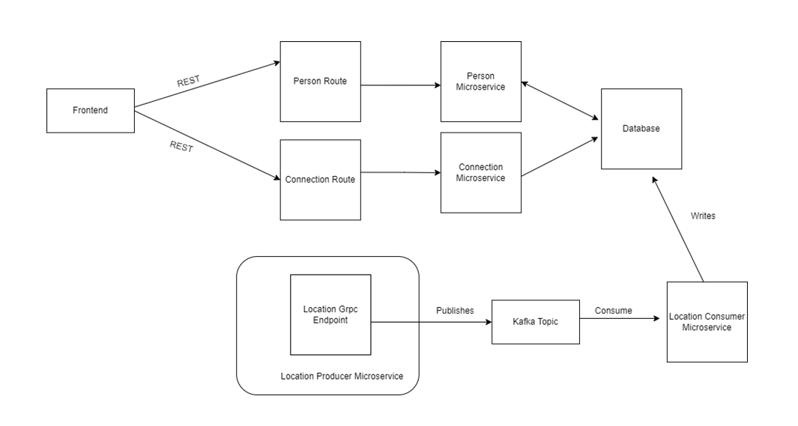

# Microservice Architecture - UdaConnect Application

## Background
Conferences and conventions are hotspots for making connections. Professionals in attendance often share the same interests and can make valuable business and personal connections with one another. At the same time, these events draw a large crowd and it's often hard to make these connections in the midst of all of these events' excitement and energy. To help attendees make connections, we are building the infrastructure for a service that can inform attendees if they have attended the same booths and presentations at an event.

## Goal

I work for a company that is building a app that uses location data from mobile devices. Your company has built a POC application to ingest location data named UdaTracker. This POC was built with the core functionality of ingesting location and identifying individuals who have shared a close geographic proximity.

Management loved the POC so now that there is buy-in, we want to enhance this application. I have been tasked to enhance the POC application into a MVP to handle the large volume of location data that will be ingested.

To do so, I will refactor this application into a microservice architecture using message passing techniques. My priority is to approach the task as an architect and refactor the application into microservices. File organization, code linting -- these are important but don’t affect the core functionality and can possibly be tagged as TODO’s for now!

## Tech Stack

### Web App
* [Python](https://www.python.org/downloads/)
* [Flask](https://flask.palletsprojects.com/)
* [PostgreSQL](https://www.postgresql.org/)

### Containerization & Virtualization
* [Docker](https://www.docker.com/)
* [Vagrant](https://www.vagrantup.com/)

### Deployment & Management of Containers
* [Kubernetes](https://kubernetes.io/)
* [K3S](https://k3s.io/)

### Messaging and Tools
* [gRPC](https://grpc.io/)
* [Protobuf](https://developers.google.com/protocol-buffers)
* [Kafka](https://kafka.apache.org/)


## Architecture

The diagram below presents the current architecture adopted for the MVP:



## Running the Project

### Build Images

Each module has its own Docker file located on its root folder:

```
.
├── modules
   ├── connectiondata-api
   │   ├── app
   │   └── Dockerfile
   ├── consumers
   │   ├── app
   │   └── Dockerfile
   ├── frontend
   │   ├── Dockerfile
   │   ├── public
   │   └── src
   ├── location-api
   │   ├── app
   │   ├── Dockerfile
   └── person-api
       ├── app
       └── Dockerfile
```

The images were constructed using the following pattern:

```shell
user@host:module_folder$ docker build -t YOUR_NAME/nd064-udaconnect-MODULE_NAME:latest . 
```

### Preparing K8S Environment

* Download and configure [VirtualBox](https://www.virtualbox.org/) and [Vagrant](https://www.vagrantup.com/docs/installation)
* Spin up Vagrant with `vagrant up` from the repository root(the location of *Vagrant* file)
  * The Vagrant file will download an os image and set up the K3S distribution for you
  * This process will take a while
* Access virtual machine with `vagrant ssh` and check the availability and operations

#### Using kubectl on Host Machine 

* Install [kubectl tool](https://kubernetes.io/docs/tasks/tools/)
* Access the VM with `vagrant ssh`
* Copy the contents from the file(on VM) `/etc/rancher/k3s/k3s.yaml` and paste it into the host file `~/.kube/config`
  * Create the file if necessary

### Deploying Modules

The folder `./deployment/` contains all K8S deployments and services files needed to run the project:

* zookeeper.yaml & kafka.yaml - Provide the needed infra for handling Kafka messaging. Based on [Bitnami images](https://hub.docker.com/r/bitnami/kafka) from Docker Hub. 
* postgres.yaml - Project PGSQL database.
* udaconnect-app.yaml - Front-end React App.
* udaconnect-connectiondata-api.yaml - ConnectionDataAPI / Geo module.
* udaconnect-consumers.yaml - Kafka consumers for Person and Location operations.
* udaconnect-location-api.yaml - LocationAPI module.
* udaconnect-person-api.yaml - PersonAPI module.

Deploying resources individually or in batch if needed:

```shell
$ kubectl apply -f deployment/postgres.yaml
```
or
```shell
$ kubectl apply -f deployment/
```

Check all deployments, pods and services by issuing:

```shell
$ kubectl get service,deployment,pod
NAME                                    TYPE        CLUSTER-IP      EXTERNAL-IP   PORT(S)          AGE
service/kubernetes                      ClusterIP   10.43.0.1       <none>        443/TCP          6d2h
service/postgres                        NodePort    10.43.29.195    <none>        5432:30143/TCP   2d2h
service/kafka                           ClusterIP   10.43.80.193    <none>        9092/TCP         2d2h
service/udaconnect-app                  NodePort    10.43.137.184   <none>        3000:30000/TCP   2d2h
service/udaconnect-location-api         NodePort    10.43.4.237     <none>        5000:30002/TCP   2d2h
service/udaconnect-person-api           NodePort    10.43.223.157   <none>        5000:30001/TCP   2d2h
service/zookeeper                       ClusterIP   10.43.165.210   <none>        2181/TCP         2d2h
service/udaconnect-connectiondata-api   NodePort    10.43.241.190   <none>        5005:30003/TCP   2d2h

NAME                                            READY   UP-TO-DATE   AVAILABLE   AGE
deployment.apps/postgres                        1/1     1            1           2d2h
deployment.apps/kafka                           1/1     1            1           2d2h
deployment.apps/zookeeper                       1/1     1            1           2d2h
deployment.apps/udaconnect-app                  1/1     1            1           2d2h
deployment.apps/udaconnect-consumers            1/1     1            1           2d2h
deployment.apps/udaconnect-connectiondata-api   1/1     1            1           2d2h
deployment.apps/udaconnect-location-api         1/1     1            1           2d2h
deployment.apps/udaconnect-person-api           1/1     1            1           2d2h

NAME                                                READY   STATUS    RESTARTS   AGE
pod/postgres-5f676c995d-jpj4c                       1/1     Running   0          2d2h
pod/kafka-86944cdf9d-t2mhb                          1/1     Running   0          2d2h
pod/zookeeper-5c9f4478d6-mhb2d                      1/1     Running   0          2d2h
pod/udaconnect-app-84b5f65d4-55vg6                  1/1     Running   0          2d2h
pod/udaconnect-consumers-7d498fb998-sx8rv           1/1     Running   2          2d2h
pod/udaconnect-connectiondata-api-7f78ff7d8-wf42t   1/1     Running   0          47h
pod/udaconnect-location-api-66c75fb9f8-btgch        1/1     Running   0          18h
pod/udaconnect-person-api-699f69d575-vqp5n          1/1     Running   0          15h
```

### Checking The Application

With all services running, the application is available through http://localhost:30000/

#### Rest Docs

* PeopleAPI - http://localhost:30001/
* LocationAPI - http://localhost:30002/
